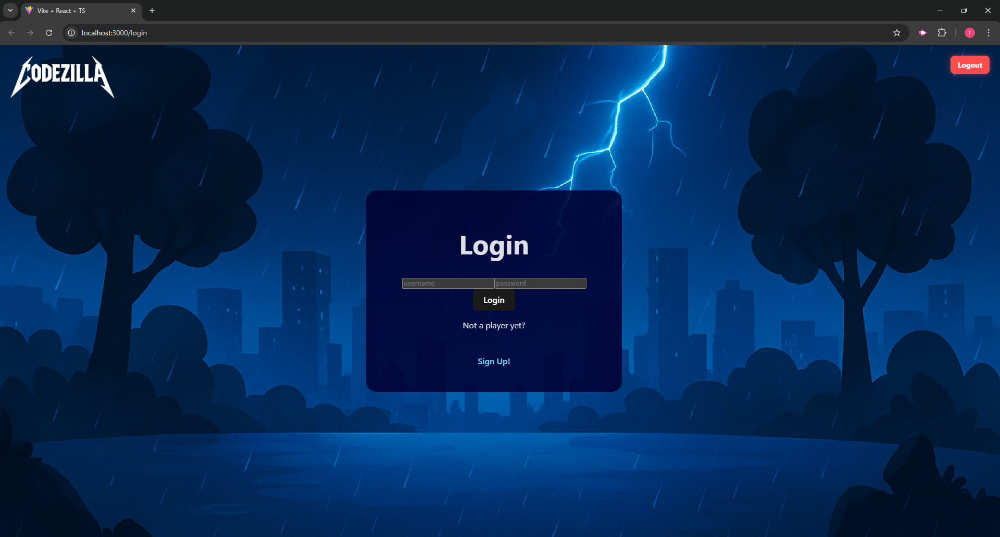
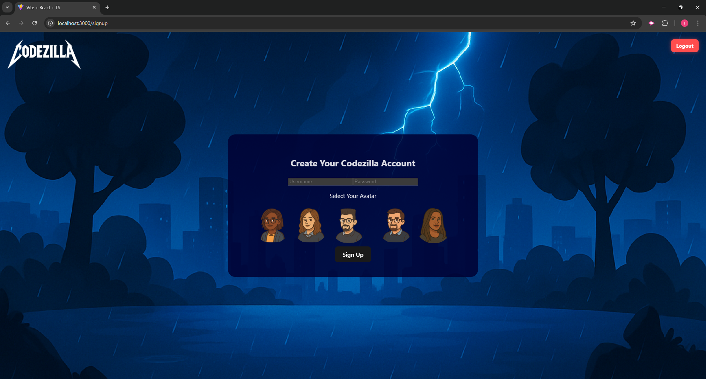
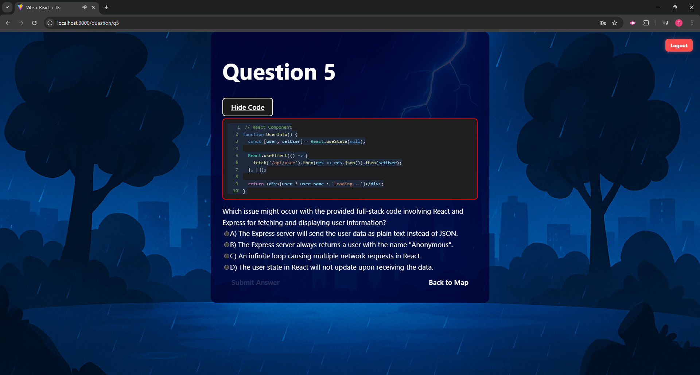
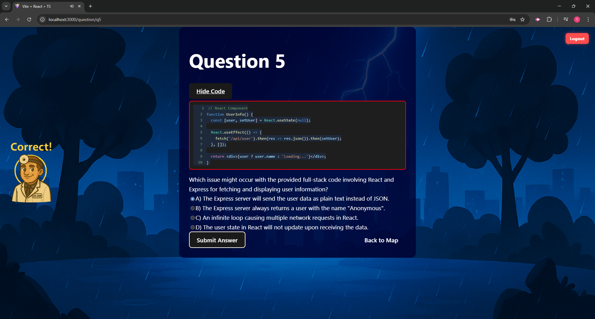
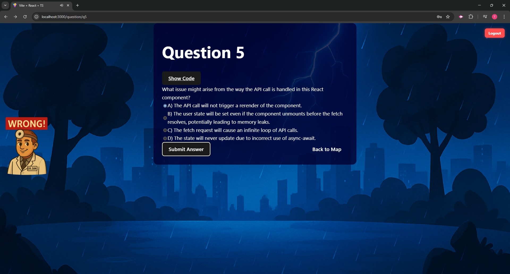
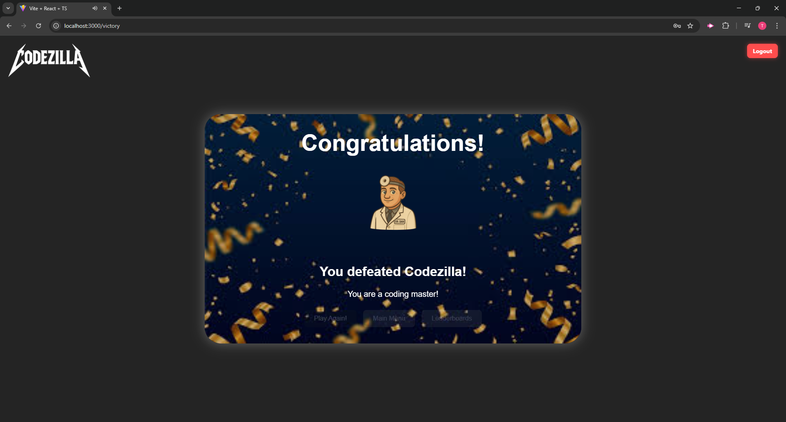
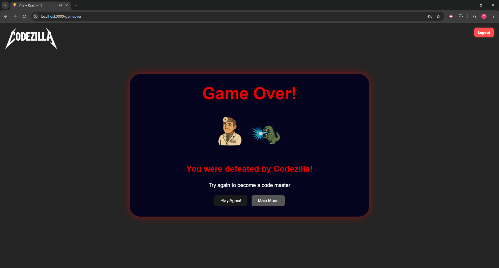

# Codezilla
  

  ## Description
 Codezilla is a full-stack MERN application that leverages AI to generate and test your coding knowledge in a gamified environment. After signing up and authenticating with JSON Web Tokens (JWT), you’ll embark on an epic journey across an interactive map to battle coding bosses—each encounter presents you with AI-powered quiz challenges. Defeat Codezilla itself to prove your mastery, and track your progress on real-time leaderboards that showcase the highest scorers from around the world.

  ## Table of Contents
  - [Installation](#installation)
  - [Usage](#usage)
  - [Technologies](#technologies)
  - [Screenshots](#screenshots)
  - [Walkthrough Video](#walkthrough-video)
  - [URL Link](#url-link)
  - [Contributing](#contributing)
  - [Contributors](#contributors)
  - [Tests](#tests)
  - [License](#license)
  - [Questions](#questions)

  ## Installation
  1. Git clone: git clone git@github.com:Treevyy/Codezilla.git

  2. Navigate to the project directory: cd Codezilla

  3. Right click the root package.json file and click open in integrated terminal

  4. Inside the terminal install the dependencies with the command: npm i

  5. After dependencies are installed run the application with the command: npm run build

  6. After the build is complete run the application with the command: npm run start (or if you are running locally npm run develop)

  ## Usage
  1. Navigate to the landing page and Sign Up or Log In.

  2. Once authenticated, you’ll be placed on the world map.

  3. Click on boss icons to start a coding battle—answer AI-generated questions to win.

  4. Continue across the map, defeating bosses of increasing difficulty.

  5. Challenge Codezilla in the final boss fight to become a Coding Master.

  6. Visit the Leaderboard page at any time to see live stats and rankings.

  ## Technologies
 
 ### Frontend

 

 ### Backend

 ### Development Tools

  ## Screenshots
  
  

  

  

  

  

  

  

  

  

  ## Walkthrough Video
  A demo of the application can be found at the following link: https://drive.google.com/file/d/1w4CuEhkTLKw2DuUM9wRGYpTyLF4cwDAl/view

  ## URL Link
  Here is the deployed link URL: https://codezilla-fnqd.onrender.com/

  ## Contributing
  This project is closed to external contributions, but feedback and bug reports are welcome via GitHub Issues.

  ## Contributors
  Thank you to all our peers that put in your effort to make this awesome application!!
  
  1. Carmen Wheeler

  2. Jacquilyn Fletcher

  3. Shawna Chrillo

  4. Michael Mangieri

  5. Trevor Moore

  ## Tests
  No automated tests are currently implemented. Future updates may include unit and integration tests.

  ## License
  This project is licensed under the MIT license.

  ## Questions
  If you have any additonal questions, you can contact me at:
  - GitHub: [Treevyy](https://github.com/Treevyy)
  - Email: [aarontrevormoore@gmail.com](mailto:aarontrevormoore@gmail.com)
